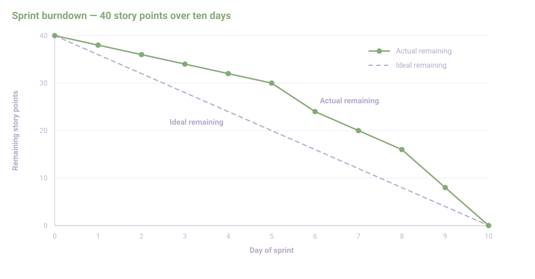

# IT Project Management

A project is a temporary undertaking with a defined start and end date, a specific objective, and allocated resources, as distinguished from ongoing operations. IT projects often present specific characteristics, including technical complexity, rapid technology evolution, dependency on existing infrastructure and third-party systems, and frequent involvement of both internal and external teams. Common causes of project failure in IT contexts include unclear requirements, scope changes without formal control, and insufficient stakeholder involvement. Key roles typically found on an IT project include the project sponsor, the project manager, the project team, end users, and the steering committee.

The project lifecycle is generally divided into five phases: initiation, planning, execution, monitoring and control, and closure. These phases can be organized according to different lifecycle models. Predictive, or sequential, lifecycles complete each phase before the next begins, while adaptive lifecycles proceed through iterative or incremental cycles that allow for adjustment as the project progresses. 
- The waterfall model is an example of a sequential lifecycle in which requirements, design, implementation, testing, and deployment occur in a fixed order.
- Iterative approaches, including Scrum and Kanban, organize work into shorter cycles and allow requirements to evolve during the project.
The choice between a predictive and an adaptive lifecycle depends on factors such as the type of project, the level of requirement uncertainty, and organizational constraints.

## 1. Project Definition and Stakeholders

### 1.1 The RACI matrix

The RACI matrix is a tool used to assign responsibilities across project tasks. Each letter designates a type of involvement: 
- Responsible refers to the person who executes the task,
- Accountable refers to the person who approves the outcome,
- Consulted refers to those who provide input before a decision is made,
- and Informed refers to those notified after a decision has been made.
A RACI matrix is typically constructed by listing project tasks in rows and roles in columns, then assigning one or more of these designations to each intersection. A common error in constructing a RACI matrix is assigning the Accountable designation to more than one role for the same task, which can create ambiguity in decision-making.

For example, if a team aims to develop a software module, involving four roles: project manager, technical lead, developer, and quality assurance analyst, they may organise as such :

| Task | Project Manager | Technical Lead | Developer | QA Analyst |
|---|---|---|---|---|
| Define technical requirements | A | R | C | I |
| Write source code | I | C | R | I |
| Conduct code review | I | R | A | C |
| Perform quality testing | I | C | I | R |
| Approve release | A | C | I | C |

Here, the technical lead is Accountable for the code review, since that role approves whether the code meets technical standards, while the developer is Responsible for writing the code being reviewed. The project manager is Accountable for approving the final release but is only Informed during the coding and testing stages, reflecting a division of decision-making authority across the project.

### 1.2 Client-side and contractor-side roles

### 2.2 Client-side and contractor-side roles

| Side | Role | Typical responsibility |
|---|---|---|
| Client | Project sponsor | Provides overall authorization and funding for the project |
| Client | Business owner | Defines business needs and validates that deliverables meet them |
| Client | Functional users | Use the system once delivered and provide functional input |
| Client | Internal IT representatives | Coordinate integration with existing internal systems |
| Contractor | Project manager | Plans and coordinates execution of the contracted work |
| Contractor | Technical lead | Oversees technical design and implementation choices |
| Contractor | Developers | Build the software components defined in the project scope |
| Contractor | Quality assurance staff | Verify that deliverables meet defined quality criteria |
| Contractor | Account manager | Manages the commercial relationship with the client |

The relationship between client and contractor is generally governed by a service agreement that defines deliverables and acceptance procedures. Communication between the two sides is usually organized through steering committees and periodic status reporting.

### 1.3 Stakeholders and governance

A stakeholder is any individual or group affected by, or able to affect, the outcome of a project. Stakeholders are typically identified through mapping techniques that classify them according to their level of influence and interest in the project. Project governance is organized through structures such as the steering committee and the project board, which hold defined decision-making authority and provide escalation paths for issues that cannot be resolved at the project team level.

Continuing with the software module development project introduced in section 1.1, the following stakeholder mapping classifies participants according to their level of influence over the project and their level of interest in its outcome.

| Stakeholder | Influence | Interest | Suggested engagement |
|---|---|---|---|
| Project sponsor | High | High | Manage closely, involve in key decisions |
| Business owner | High | High | Manage closely, involve in key decisions |
| Functional users | Low | High | Keep informed, gather feedback regularly |
| Internal IT representatives | Medium | Medium | Keep satisfied, consult on integration issues |
| Quality assurance staff | Low | Medium | Keep informed of testing milestones |
| External regulator | High | Low | Keep satisfied, monitor compliance requirements |

Based on this mapping, project governance for the module development might be organized as follows. The project team resolves day-to-day issues, such as task-level technical decisions, without escalation. Issues affecting scope, budget, or schedule are escalated to a steering committee composed of the project sponsor, the business owner, and the contractor's project manager, which meets on a periodic basis to review status and approve changes. Issues that cannot be resolved by the steering committee, such as a disagreement over contract terms, are escalated further to a project board with authority to make final decisions or terminate the project.

## 2. Legal and Regulatory Aspects

### 2.1 ITIL

[The Information Technology Infrastructure Library](https://www.itil.com/), is a framework of practices for IT service management. As defined in the [ITIL 4](https://www.peoplecert.org/browse-certifications/it-governance-and-service-management/ITIL-1/itil-4-foundation-2565), the framework is structured around a service value chain and a set of management practices. ITIL differs from project management methodologies in that it addresses the ongoing delivery and support of IT services rather than the execution of temporary undertakings. Certain ITIL practices, such as incident management and change management, are relevant to IT projects during transition to operations and during the operational phase that follows project closure.

Returning to the software module development project described in section 1.1, ITIL practices become relevant once the module moves from development into production use. When the module is deployed, the contractor's change management practice governs how the release is authorized, scheduled, and communicated to affected users, reducing the likelihood of disruption to existing systems. After deployment, if functional users report a defect, this is handled through the incident management practice, which prioritizes and resolves the issue based on its impact on business operations. If the defect requires a modification to the module's design, this is addressed through a further change request rather than through the original project's governance structure, since the project has formally closed and responsibility for the module has transferred to the organization's ongoing service management function.

### 2.2 The PMBOK framework

[The Project Management Body of Knowledge](https://www.pmi.org/standards/pmbok) is a set of standards and guidelines published by the Project Management Institute. The sixth edition of the PMBOK Guide organizes project management activity into ten knowledge areas and five process groups, combined into a matrix of forty-nine distinct processes. The ten knowledge areas cover the following aspects of a project:

| Knowledge area | Focus |
|---|---|
| Integration management | Coordinating the various elements of the project into a coherent whole, including the project charter and change control |
| Scope management | Defining and controlling what is included and excluded from the project, typically through a work breakdown structure |
| Schedule management | Sequencing activities, estimating durations, and developing the project schedule |
| Cost management | Estimating, budgeting, and controlling project costs |
| Quality management | Defining quality requirements and verifying that deliverables meet them |
| Resource management | Acquiring, developing, and managing the project team and physical resources |
| Communications management | Planning and distributing project information to stakeholders |
| Risk management | Identifying, analyzing, and responding to project risks |
| Procurement management | Managing contracts and purchases from external suppliers |
| Stakeholder management | Identifying stakeholders and managing their expectations and involvement |

Each knowledge area contains processes distributed across the five process groups: initiating, planning, executing, monitoring and controlling, and closing. For example, within scope management, the process "collect requirements" belongs to the planning group, while "validate scope" belongs to the monitoring and controlling group. This structure allows a project manager to identify, for any given knowledge area, which activities occur at each stage of the project.

The Project Management Institute also publishes an [Agile Practice Guide](https://www.pmi.org/standards/agile), developed jointly with the Agile Alliance, which addresses iterative and adaptive approaches to project delivery, including Scrum, Kanban, and hybrid life cycles, and describes how these approaches relate to the practices described in the PMBOK Guide.

### 2.3 Compliance and legal obligations

IT projects are subject to a set of contractual and regulatory obligations that extend beyond the technical scope of the work itself.

**Service level agreements and deliverable specifications** define measurable performance commitments that the contractor must meet during and after project execution. They are often based on:

| Metric | Description |
|---|---|
| Availability | Percentage of time a system or service is operational |
| Response time | Maximum time allowed to acknowledge a reported issue |
| Resolution time | Maximum time allowed to resolve a reported issue |
| Defect density | Number of defects per unit of delivered code |

**Data protection requirements under the General Data Protection Regulation**

Within the European Union, IT projects that process personal data are subject to the [General Data Protection Regulation](https://gdpr-info.eu/), such as :

- [Article 25](https://gdpr-info.eu/art-25-gdpr/), which requires data protection by design and by default, meaning that personal data safeguards must be built into the system architecture rather than added afterward.
- [Article 28](https://gdpr-info.eu/art-28-gdpr/), which governs the relationship between a data controller (typically the client) and a data processor (typically the contractor), requiring a data processing agreement that specifies the purpose, duration, and nature of the processing.
- [Article 32](https://gdpr-info.eu/art-32-gdpr/), which requires appropriate technical and organizational measures to ensure the security of personal data, such as encryption and access controls.
- [Article 33](https://gdpr-info.eu/art-33-gdpr/), which requires notification of a personal data breach to the relevant supervisory authority within 72 hours of becoming aware of it.

For the software module example introduced in section 1.1, if the module processes user account data, the contract between client and contractor would need to include a data processing agreement specifying that the contractor acts as a processor on behalf of the client, along with the security measures the contractor commits to implementing.

**Intellectual property ownership**

Contracts for custom software development generally specify whether the contractor assigns full ownership of the developed code to the client upon payment, or whether the contractor retains ownership and grants the client a license to use it. A further distinction is commonly made between:

- Pre-existing intellectual property, such as libraries or frameworks the contractor already owned before the project began, which the contractor typically retains ownership of while granting the client a license to use it as part of the delivered solution.
- Newly developed intellectual property, created specifically for the project, which is more commonly assigned to the client under a work-for-hire style clause.

## 3. Project Planning

### 3.1 Gantt chart

A Gantt chart is a bar chart representing a project schedule, showing the start and end date of each task. It usually includes task durations, dependencies between tasks, milestones, and the critical path, which identifies the sequence of tasks that determines the shortest possible project duration.

**Constructing a Gantt chart from a work breakdown structure**

A Gantt chart is generally derived from a work breakdown structure that decomposes the project into manageable tasks. Returning to the software module development project introduced in section 1.1, a simplified work breakdown structure might identify the following tasks, durations, and dependencies:

| Task ID | Task | Duration (days) | Predecessor |
|---|---|---|---|
| A | Define technical requirements | 3 | None |
| B | Design system architecture | 4 | A |
| C | Develop backend components | 8 | B |
| D | Develop frontend components | 6 | B |
| E | Conduct code review | 2 | C, D |
| F | Perform quality testing | 5 | E |
| G | Prepare release documentation | 3 | E |
| H | Deploy to production | 1 | F, G |

Task E cannot begin until both C and D are complete, and task H cannot begin until both F and G are complete. Two paths run through this schedule from start to finish:

- Path 1: A, B, C, E, F, H, with a total duration of 3 + 4 + 8 + 2 + 5 + 1 = 23 days.
- Path 2: A, B, D, E, G, H, with a total duration of 3 + 4 + 6 + 2 + 3 + 1 = 19 days.

Path 1 has the longer duration and therefore constitutes the critical path. Any delay affecting tasks A, B, C, E, F, or H directly delays the project's completion date, while task D has four days of float and could be delayed by up to that amount without affecting the overall schedule.

On the Gantt chart itself, each task in the table above is drawn as a horizontal bar positioned along a timeline, with its length proportional to its duration. Tasks on the critical path are typically highlighted, for example in a different color, to distinguish them from tasks with float. Milestones, such as the completion of the design phase after task B or the production deployment marking task H, are usually represented as separate markers rather than bars, since they denote a point in time rather than a duration.

### 3.2 Burndown chart

A burndown chart is a graphical representation of work remaining over time, used primarily in iterative project management. A sprint burndown chart tracks remaining work within a single iteration, while a release burndown chart tracks remaining work across multiple iterations toward a release date.

**Sprint burndown example**

Suppose the backend development task (task C) from the work breakdown structure in section 3.1 is instead organized as a two-week sprint, with the work estimated at 40 story points at the start of the sprint. The team records remaining work at the end of each working day:

| Day | Remaining work (story points) | Ideal remaining work |
|---|---|---|
| 1 | 40 | 36 |
| 2 | 38 | 32 |
| 3 | 35 | 28 |
| 4 | 33 | 24 |
| 5 | 30 | 20 |
| 6 | 24 | 16 |
| 7 | 20 | 12 |
| 8 | 16 | 8 |
| 9 | 10 | 4 |
| 10 | 0 | 0 |

The ideal remaining work column represents a straight-line reduction from 40 points to 0 over ten working days, assuming a constant completion rate of 4 points per day. Plotting both series on the same chart allows the team to compare actual progress against this reference line. In this example, actual progress lags behind the ideal line through day 6, then accelerates and reaches zero on schedule by day 10.

If the actual line remains consistently above the ideal line, this indicates that the team is completing work more slowly than planned and may not finish all planned work by the end of the sprint. If the actual line flattens over several consecutive days, this indicates that no work is being completed and may prompt the team to investigate blockers during a daily stand-up meeting.

A burndown chart does not by itself distinguish between work completed and work removed from scope. For example, if on day 5 the team had removed 10 story points from the sprint rather than completing them, the chart would show the same drop from 30 to 20 points, but the underlying cause would be different. To preserve the usefulness of the chart, scope changes of this kind are typically annotated directly on the chart or recorded separately, so that a drop in remaining work can be correctly attributed to either completed work or a change in scope.

While the example above tracks a single two-week sprint, a release burndown chart would instead track total remaining work across several sprints, measured at the end of each sprint rather than each day, in order to assess progress toward a release date spanning multiple iterations.

## 4. Risk Management and Team Facilitation

### 4.1 Risk identification and analysis

A project risk is an uncertain event that, if it occurs, has a positive or negative effect on project objectives.

Qualitative analysis assesses each identified risk according to its probability of occurrence and its impact on project objectives, typically using a relative scale such as low, medium, or high. These two dimensions are often combined into a probability and impact matrix, which allows risks to be ranked by priority. Returning to the software module development project introduced in section 1.1, the following risks might be identified during a brainstorming session with the project team:

| Risk | Probability | Impact | Priority |
|---|---|---|---|
| Key developer becomes unavailable during backend development | Medium | High | High |
| Third-party library used in the module is deprecated before release | Low | Medium | Low |
| Client delays sign-off on technical requirements | Medium | Medium | Medium |
| Integration with existing internal systems reveals unforeseen incompatibilities | Medium | High | High |
| Quality assurance identifies a critical defect close to the release date | Low | High | Medium |

**Quantitative analysis**

Quantitative analysis assigns numerical estimates to potential outcomes, allowing risks to be compared on a common scale. One common technique is to calculate the expected monetary value of a risk by multiplying its estimated probability of occurrence by its estimated financial impact. For example, if the risk "integration with existing internal systems reveals unforeseen incompatibilities" is estimated at a 40 percent probability of occurring and an estimated cost of 20,000 currency units in additional development effort if it does occur, its expected monetary value is 0.4 multiplied by 20,000, or 8,000 currency units. This figure can be compared against the expected monetary value of other risks to help prioritize where contingency reserves should be allocated.

The results of this analysis are recorded in a risk register, which lists each identified risk along with its estimated probability, its potential impact, and the person responsible for monitoring it:

| Risk ID | Description | Probability | Impact | Expected monetary value | Owner |
|---|---|---|---|---|---|
| R1 | Key developer unavailable during backend development | Medium | High | 6,000 | Technical lead |
| R2 | Third-party library deprecated before release | Low | Medium | 1,500 | Developer |
| R3 | Client delays sign-off on requirements | Medium | Medium | 3,000 | Project manager |
| R4 | Integration reveals unforeseen incompatibilities | Medium | High | 8,000 | Technical lead |
| R5 | Critical defect identified close to release | Low | High | 4,000 | QA analyst |

This register serves as the reference document used to develop the mitigation strategies described in section 4.2.

### 4.2 Mitigation plans

For risks with a negative effect on project objectives, four response strategies are commonly used: avoidance, which eliminates the risk by changing the project approach; mitigation, which reduces the probability or impact of the risk; transfer, which shifts responsibility for the risk to a third party; and acceptance, which involves taking no preventive action beyond monitoring. Corresponding strategies exist for risks with a positive effect, referred to as opportunities: exploitation, which seeks to ensure the opportunity occurs; enhancement, which increases the probability or impact of the opportunity; sharing, which allocates the opportunity to a third party better positioned to capture it; and acceptance, which involves taking no proactive action.

Returning to the risk register developed in section 4.1, a response strategy can be assigned to each identified risk:

| Risk ID | Description | Response strategy | Action |
|---|---|---|---|
| R1 | Key developer unavailable during backend development | Mitigation | Cross-train a second developer on the backend codebase early in the project |
| R2 | Third-party library deprecated before release | Acceptance | Monitor the library's release notes; no action taken unless deprecation is announced |
| R3 | Client delays sign-off on requirements | Mitigation | Set a contractual deadline for sign-off with defined consequences for delay |
| R4 | Integration reveals unforeseen incompatibilities | Avoidance | Conduct a technical compatibility assessment before finalizing the system architecture |
| R5 | Critical defect identified close to release | Transfer | Include a warranty clause requiring the contractor to fix post-release defects at no additional cost |

For risk R2, which is accepted rather than actively mitigated, a contingency plan specifies the action to take if the library is in fact deprecated, such as allocating two additional developer days to migrate to an alternative library. A corresponding contingency reserve of the equivalent cost is set aside in the project budget, separate from the general management reserve, and is only drawn upon if the risk materializes.

Risks recorded in the register are reviewed at defined intervals, for example during each steering committee meeting described in section 2.3, to assess whether their probability or impact has changed. For instance, if the client provides technical requirements ahead of schedule, the probability associated with risk R3 would be revised downward and the corresponding contingency reserve could be reduced or reallocated. Newly identified risks are added to the register as they arise, since the risk identification process described in section 4.1 continues throughout the project rather than occurring only at its start.

### 4.3 Facilitation techniques

The project manager, or in agile contexts the Scrum Master, is generally responsible for facilitating team meetings. Common facilitation formats include daily stand-up meetings, retrospectives held at the end of an iteration, and structured workshops.

**A Daily stand-up meeting** is typically timeboxed to fifteen minutes and held at the same time and location each day. Each participant addresses three questions in turn: what was completed since the previous meeting, what is planned before the next meeting, and what obstacles are impeding progress. For the software module development project introduced in section 1.1, a developer might report having completed the backend data validation logic, plan to begin unit testing that day, and flag that access to the staging environment is still pending from the internal IT representative. This last point would be recorded as an obstacle for the Scrum Master to resolve outside the meeting, rather than discussed in detail during the stand-up itself.

**A Retrospective** is held at the end of an iteration and typically follows a structured format such as "what went well," "what did not go well," and "what should change going forward." Continuing the same example, if the team's retrospective at the end of the sprint described in section 4.2 identifies that the staging environment access delay recurred across multiple days, the team might agree on a specific action, such as requesting staging credentials during project setup rather than at the start of each sprint, with the internal IT representative named as responsible for the change.

**A Structured workshop** is used for activities requiring input from multiple participants over a longer period, such as the requirements definition task (task A) in the work breakdown structure from section 3.1. Two techniques commonly used to structure such a workshop are:

- Timeboxing, which allocates a fixed duration to each agenda item, for example twenty minutes to review existing requirements documentation before moving to a discussion of new requirements, in order to prevent a single topic from consuming the entire session.
- Round-robin input collection, which requires each participant, such as the business owner, a functional user, and the technical lead, to state their input in turn before open discussion begins, in order to prevent a single participant from dominating the conversation.

**Conflict resolution** within project teams is typically addressed through structured negotiation or mediation led by the project manager or a designated facilitator. For example, if the technical lead and a functional user disagree during the requirements workshop about whether a feature is technically feasible within the project timeline, the project manager might mediate by separating the discussion into two distinct questions, technical feasibility and business priority, and addressing each in turn with the relevant party before proposing a compromise.

